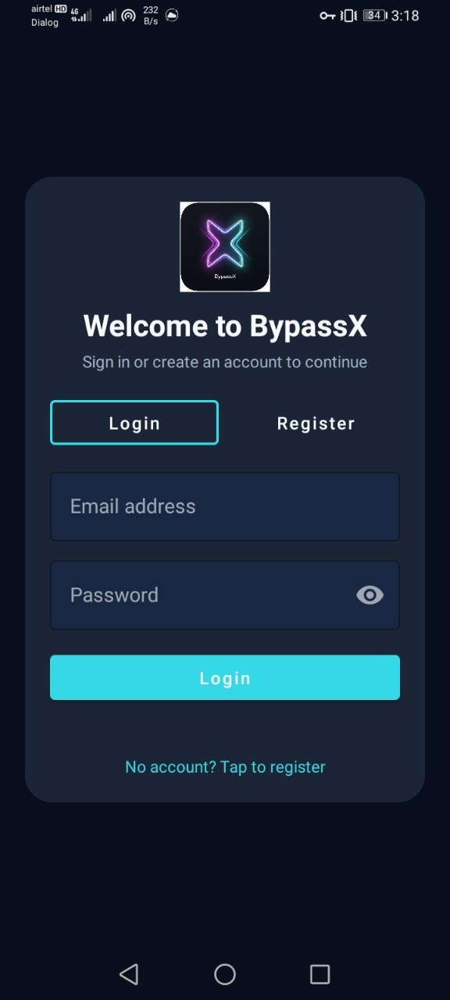
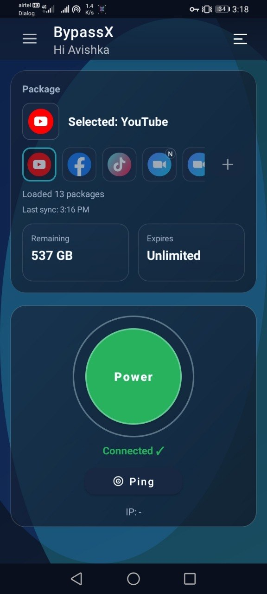
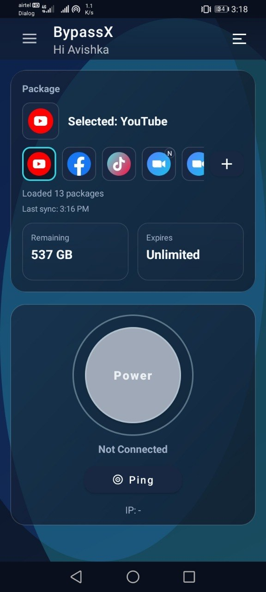

# BypassX

BypassX is an Android VPN client with a Node.js backend and 3x-ui integration.

It supports per-user provisioning on 3x-ui, approval-based onboarding, subscription-driven config loading, built-in app packages with SNI override, Custom SNI mode, split tunnel, and proxy tethering.

## Architecture

This repository contains three main parts:

- `app/`: Android app (Java + Material UI)
- `backend-mern-auth-main/`: Auth + approval backend (Express + MongoDB)
- `v2ray/`: Embedded V2Ray/Xray Android module

High-level flow:

1. User registers in app.
2. Admin approves/rejects via emailed action link.
3. On approval, backend creates a user client in 3x-ui inbound.
4. Backend returns user-specific `subscriptionUrl` at login.
5. App downloads the subscription, parses VLESS links, and generates package configs.
6. App applies package SNI/host override before connecting.

## Key Features

### Authentication and Approval

- Login/Register with email OTP verification.
- Pending/Active/Rejected account states.
- Admin approval by secure token link.

### 3x-ui User Provisioning

- Creates one client per approved user.
- Stores user metadata (`xuiSubId`, client email/id, quota, expiry, subscription URL).
- Fetches traffic status for remaining data and expiry display.

### Modern Main UI

- Compact package chooser.
- Built-in package list and Custom SNI entry.
- Remaining data + expiry cards (cache-first, online refresh).
- Connection state, ping, and polished dashboard visuals.

### Networking Features

- VPN connect/disconnect via V2Ray service.
- Split Tunnel app exclusion.
- Proxy Tethering mode and panel.
- Quick Settings tile support.

## App Screenshots

<p align="center">
	
	
	
</p>

## Built-in Packages (SNI)

- YouTube -> `www.youtube.com`
- Facebook -> `www.facebook.com`
- TikTok -> `www.tiktok.com`
- Zoom (Normal) -> `www.zoom.us`
- Zoom (Dialog) -> `www.aka.ms`
- X (Twitter) -> `www.x.com`
- Instagram -> `www.instagram.com`
- Viber -> `www.viber.com`
- Netflix -> `www.netflix.com`
- WhatsApp -> `www.whatsapp.com`
- Telegram -> `web.telegram.org`
- Spotify -> `open.spotify.com`
- LinkedIn -> `www.linkedin.com`

Also available:

- `Custom SNI` option in package picker (user-entered hostname).

## Environment Configuration

No server-specific values are hardcoded for XUI provisioning; backend behavior is driven by env values.

### Root `.env` (Android build-time)

```env
SUBSCRIPTION_URL=https://example.com/sub.txt
AUTH_BASE_URL=https://your-auth-backend.example.com
ADMIN_PIN=2468
APP_PIN=1994
```

### `backend-mern-auth-main/.env`

```env
PORT=4000
MONGODB_URL=mongodb+srv://...
JWT_SECRET=...
BREVO_API_KEY=...
SENDER_EMAIL=...
ADMIN_APPROVAL_EMAIL=...

XUI_PANEL_URL=https://panel.example.com:PORT/PANELPATH
XUI_USERNAME=...
XUI_PASSWORD=...
XUI_INBOUND_ID=1
XUI_DEFAULT_QUOTA_GB=10
XUI_DEFAULT_EXPIRY_DAYS=10
XUI_SUB_PATH=/sub/
XUI_SUB_URI=

BACKEND_PUBLIC_URL=https://your-public-backend.example.com
NODE_ENV=production
```

Notes:

- `XUI_SUB_URI` can be left empty. If set, it overrides generated subscription base URL.
- Ensure subscription port/path is reachable from mobile clients (firewall/UFW/CDN rules).

## Build and Run

### Android

```bash
./gradlew :app:assembleDebug
```

### Backend

```bash
cd backend-mern-auth-main
npm install
npm start
```

## CI/CD

GitHub Actions workflow builds Android and writes both root and backend `.env` files from repository secrets.

Primary workflow file:

- `.github/workflows/android-build.yml`

## Troubleshooting

### Remaining/Expiry visible but packages not loading

Common cause: app cannot fetch subscription URL from device network.

Checklist:

1. Subscription URL is reachable over internet from phone.
2. Correct port is open in firewall/UFW.
3. TLS certificate is valid for subscription host.
4. User login response contains valid `subscriptionUrl`.

### App says frequent background refresh

Expected to some degree while VPN service is active (foreground service + traffic/status broadcasts). If needed, polling intervals can be tuned.

## Credits

- [Xray core](https://github.com/XTLS/Xray-core)
- [AndroidLibXrayLite](https://github.com/2dust/AndroidLibXrayLite)

## Disclaimer

This project is for educational purposes only.


