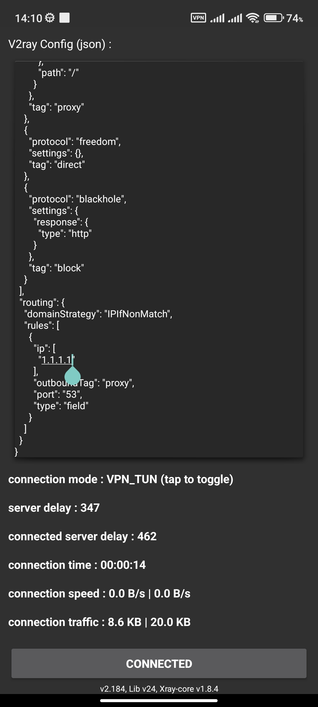
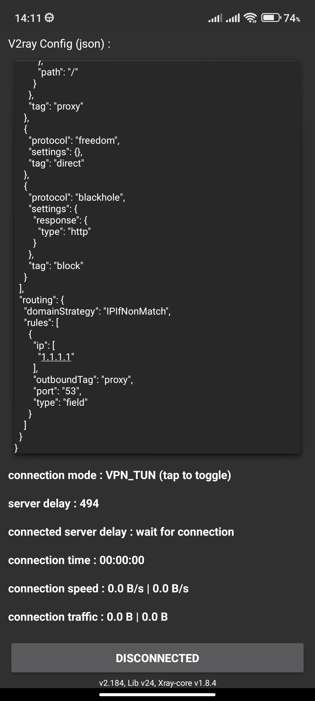

# BypassX VPN Client

BypassX is an Android VPN client built on top of the Xray core through the `v2ray` module in this repository. It provides a practical Java-based sample app with a modern UI, subscription config loading, proxy tethering, split tunnel support, and a dedicated About screen.

## Highlights

- VPN client powered by Xray core
- Java Android app with Material UI
- Subscription-based config loading from a remote source
- Package selection dashboard for supported apps
- Ping check directly inside the main action button
- Proxy tethering panel for hotspot sharing
- Split tunnel support for excluding selected apps from VPN
- Foreground service notification with stable behavior
- Dedicated About screen and branded drawer header

## Screens

- Main dashboard for connection control and package selection
- About screen with app information
- Navigation drawer with proxy tethering and split tunnel controls
- Foreground VPN notification for connection status

## Requirements

- Android Studio latest stable version
- JDK 8 or later
- Android SDK 34
- Android device or emulator running Android 8.0+
- Internet access for subscription loading and VPN usage

## Project Structure

- `app/` - Main Android application
- `v2ray/` - Xray/V2ray library module and services
- `BypassX.png` - App logo asset used by the project
- `connected.jpeg` / `disconnected.jpg` - Sample screenshots

## Build Setup

The project already includes the required Gradle and module configuration.

### Open in Android Studio

1. Clone this repository.
2. Open it in Android Studio.
3. Let Gradle sync finish.
4. Build or run the `app` module on a device or emulator.

### Command Line Build

```bash
./gradlew assembleDebug
```

To create a release build:

```bash
./gradlew assembleRelease
```

## Runtime Configuration

The app reads the subscription URL from the root `.env` file.

Example:

```env
SUBSCRIPTION_URL=https://example.com/subscription.txt
```

If the value is empty, the app will still build, but subscription loading will not work until you set a valid URL.

## How to Use

1. Launch the app.
2. Wait for subscription configs to load.
3. Select one of the supported packages.
4. Tap the large Power button to connect.
5. Use the Ping button to test latency directly on the button itself.
6. Open the drawer to access Proxy Tethering and Split Tunnel.
7. Open About from the drawer for app details.

## Supported Features

### Package Selection
The main screen displays a set of supported app targets such as YouTube, Zoom, WhatsApp, Viber, Netflix, and Instagram. Select one before connecting.

### Ping Check
The Ping button runs a quick connectivity test and shows the result directly inside the button text.

### Proxy Tethering
The side drawer includes a proxy tethering panel with hotspot-related controls and logging for sharing the VPN connection.

### Split Tunnel
The side drawer also includes split tunnel support so selected apps can bypass the VPN and use direct internet.

### Notification Behavior
The VPN service runs as a foreground service and keeps the notification stable while removing traffic speed meter updates from the notification bar.

## App Icon and Branding

The app uses the custom `BypassX.png` logo asset as the launcher icon and branding image in the app UI.

## Sample Screenshots

<p align="center">
  
  
</p>

## Libraries and Credits

- [Xray core](https://github.com/XTLS/Xray-core)
- [AndroidLibXrayLite](https://github.com/2dust/AndroidLibXrayLite)
- [vpnparser](https://github.com/gvcgo/vpnparser)

## Notes

- This project uses a foreground VPN service and requires the appropriate Android VPN permissions.
- Traffic statistics in the notification bar are disabled in the current build for a cleaner experience.
- The project is intended as a functional sample and starting point for further development.
-This project for Education purpose Only.


